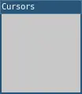

# cursor()
 
**Note: This page was automatically ported from p5.js to L5 and hasn't yet been checked, fixed and updated. The code is likely incorrect, and the description or parameters might be wrong!**

Changes the cursor's appearance.

The first parameter, `type`, sets the type of cursor to display. The built-in options are `ARROW`, `IBEAM`, `WAIT`, `CROSSHAIR`, `WAITARROW`, `SIZENWSE`, `SIZENESW`, `SIZEWE`, `SIZENS`, `SIZEALL`.

If the path to an image is passed, as in `cursor('/assets/target.png')`, then the image will be used as the cursor. Images should generally be at most 32 by 32 pixels large.

The parameters `x` and `y` are optional. If an image is used for the cursor, `x` and `y` set the location pointed to within the image. They are both 0 by default, so the cursor points to the image's top-left corner. `x` and `y` must be less than the image's width and height, respectively.

## Examples



```lua
function setup()
  size(100, 100)

  windowTitle("Cursors")
  describe('A gray square. The cursor appears as crosshairs.')
end

function draw()
  background(200)

  -- Set the cursor to crosshairs: +
  cursor(CROSSHAIR)
end
```

## Syntax

```lua
cursor(type, [x], [y])
```

## Parameters

| Parameter |                                                                      |
| -         | --------------------------------------------------                   |
| type      | Constant/String: Built-in names of cursor, or path to cursor image.  |
| x         | Number: x-coordinate of the center of the ellipse.                   |
| y         | Number: y-coordinate of the center of the ellipse.                   |


## Related

* [noCursor()](noCursor.md)
