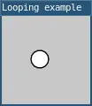

# isLooping()
 
**Note: This page was automatically ported from p5.js to L5 and hasn't yet been checked, fixed and updated. The code is likely incorrect, and the description or parameters might be wrong!**

Returns `true` if the draw loop is running and `false` if not.

By default, draw() tries to run 60 times per
second. Calling noLoop() stops
draw() from repeating. The draw loop can be
restarted by calling loop().

The `isLooping()` function can be used to check whether a sketch is
looping, as in `isLooping() == true`.

## Examples



```lua
function setup() 
  size(100, 100)

  windowTitle("Looping example")
  describe('A white circle drawn against a gray background. When the user clicks, the circle stops or resumes following the mouse.')
end

function draw() 
  background(200)

  -- Draw the circle at the mouse's position.
  circle(mouseX, mouseY, 20)
end

-- Toggle the draw loop when the user clicks
function mousePressed() 
  if isLooping() == true then
    noLoop()
  else 
    loop()
  end
end
```

## Return

Boolean

## Related

* [loop()](loop.md)
* [noLoop()](noLoop.md)
