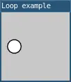

# loop()
 
**Note: This page was automatically ported from p5.js to L5 and hasn't yet been checked, fixed and updated. The code is likely incorrect, and the description or parameters might be wrong!**

Resumes the draw loop after noLoop() has been
called.

By default, draw() tries to run 60 times per
second. Calling noLoop() stops
draw() from repeating. The draw loop can be
restarted by calling `loop()`.

The isLooping() function can be used to check
whether a sketch is looping, as in `isLooping() == true`.

## Examples



```lua

function setup() 
  size(100, 100)

  -- Turn off the draw loop.
  noLoop();

  windowTitle('Loop example')
  describe(
    'A white circle starts moving to the right when the user clicks.'
  )
end

function draw() 
  background(200)

  -- Calculate the circle's x-coordinate.
  local x = frameCount

  -- Draw the circle.
  circle(x, 50, 20)
end

-- Resume the draw loop when the user double-clicks.
function mousePressed() 
  loop()
end
```

## Syntax

```
loop()
```

## Related

* [noLoop()](noLoop.md)
* [isLooping()](isLooping.md)
